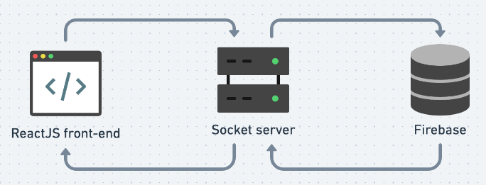

# message_socketIO
Study case based on Google Chat, meant to practice ReactJS, Sockey.IO and CSS.

## Technologies and its main developed concepts 
* **JavaScript**
  frontend and backend

### Frontend 
* ReactJS
  * contextAPI
  * useEffect
  * useState
  * personal hooks creation
  
  **Style**
  * Styled components

### Backend
* Express server - backend socket interface
  * [Socket.IO](https://socket.io/docs/v4) - event based communication
  * Module.exports
* [Firebase](https://firebase.google.com/docs/web/setup) - realtime database
  Backend as a service, solution that provides an API to data persistence, auth and more.
---
## The project - Still being develop!!
Initialy, the idea was to make the chat run alone with Socket.IO doing the travelling and connections, but as I evolved and learned, tought about how could I persist the data. When I discovered about Firebase at NextLevelWeek event - you can [check the code here](https://github.com/viniciuSquare/NLW-06_Letmeask) - I started to convert to use the solution. 

It have feature to callback based on its data events, solution that could make unecessary Socket server usage but the free version limits could be a problem if it gets in use. 

To avoid many listeners, the solution was to keep the socket server to travel the data between clients also training the node modules concept. This also improves security allowing ease setting on firebase, as the only incoming connection is from socket server.

<p>
  
</p>


---
## How to run the project
``cd message_client && npm start``- it will start ReactJS frontend

``cd backend && npm start`` - it will start the Socket.IO server at port 4001

To run you'll need to create a Firebase project
Run this to create the file `touch backend/services/firebase.js` then implement the following code using your project's credentials:

```javascript
  var firebase = require("firebase/app");
  require ('firebase/database')

  const firebaseConfig = {
    apiKey: "***",
    authDomain: "***",
    databaseURL: "***",
    projectId: "***",
    storageBucket: "***",
    messagingSenderId: "***",
    appId: "***"
  };

  firebase.initializeApp(firebaseConfig)
  module.exports = firebase

```
